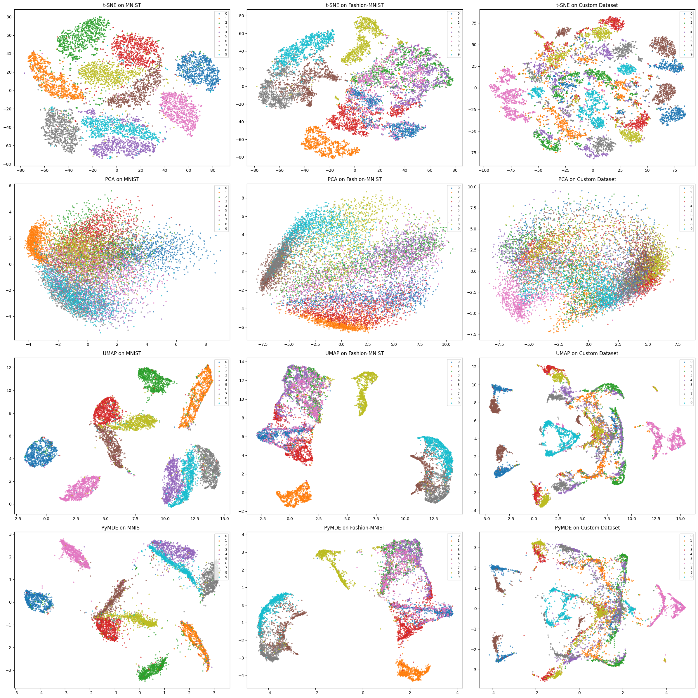

# Animal-Shape-MNIST
##### UNDER CONSTRUCTION, WILL BE COPIED TO KAGGLE AFTER FINALIZATION ################
A dataset capable of supporting scalable and cost-efficient benchmarking on top of being an educational resource 
## Table of content
- Purpose of this experiment 
- How to access the data 
- Usage 
- Benchmark 
- Visualization
  
Animal-Shape is a dataset consisting of 10,000 images of 28x28 grayscale images, mimicking the format of MNIST dataset. There are 10 classes of animals (including Bear, Bird, Cat, Cow, Dog, Elephant, Giraffe, Horse, Sheep, Zebra) each consisting of 1000 pictures. 
This is intended to serve educational purposes and expand further on the MNIST - fashion MNIST benchmarking system for machine learning algorithms. 
Here's an example of how the data looks:


## Purpose of this experiment
The work reported here extends MNIST’s simple and clean format to a new domain involving shape of animals, providing a dataset for anyone exploring new challenges in image recognition and classification. The dataset can further be utilized as benchmark for testing models performance of classification. 
The proposed approach used to create the dataset, may be generalized to create other datasets in different domains. This showcases how to generate high-quality training data without requiring massive real-world data collection efforts and in turn reducing dependency on costly data labelling, as this method is vastly more cost-effective than traditional dataset creation by leveraging synthetic data generation and automated object detection. 
The methodology could inspire similar extensions to other fields, such as medical imaging, industrial object recognition, or remote sensing, where clean, structured datasets are needed. 

Some other applications would be: 
- Few-Shot Learning: Evaluating models with limited training data from the dataset. 
- Shape-Based Recognition: Encouraging research into recognition tasks focused on shape and structure rather than texture. 
- Synthetic-to-Real Transfer: To use as an intermediate step to train models that later generalize to real-world animal datasets (e.g., COCO). 
- Evaluating Synthetic-to-Real Generalization: Test whether models trained on synthetic data can generalize to real-world datasets. 
- Educational purposes: The dataset can be a resource for teaching object detection, image classification, and dataset generation techniques.

By resembling MNIST in its structure, animal shape dataset maintains relative simplicity, making it user-friendly and accessible for beginners and advanced practitioners alike; Although it has more complexity, this dataset has less easily discernible structured features when compared to MNIST and FAHION-MNIST, potentially providing more insight into the ability of models. By showcasing animals from various different angles and including occasional small noise, this dataset mimics real-world challenges like variations in perspective, lightning, minor artifacts, ensures not being biased toward ideal or consistent conditions, challenges models to learn invariant representations and adds the capability of testing the robustness of models.
## How to access the data
[Will look into adding it to already known libraries such as Tensorflow, Hugging Face, PytorchHub. ]
You can clone this GitHub repository; the dataset appears under data/animal_shape. This repo also contains python script for benchmarking. 

```git clone https://github.com/SinaSR-6/Animal-Shape-MNIST.git```

You could also install the package using
```pip install animal-shape-mnist==0.39```
and then for loading the dataset:
```
from animal_shape_mnist.dataset_Loader import load_animal_shape_dataset
from animal_shape_mnist.dataset_Loader import load_fashion_mnist_data
from animal_shape_mnist.dataset_Loader import load_mnist_data

X_train, y_train = load_mnist_data() 
X_test_f, y_test_f = load_fashion_mnist_data() 
X_test_animal,y_test_animal = load_animal_shape_dataset()
```


## Labels
This is how the images are assigned their class ID:
| Class ID | Animal       |
|----------|--------------|
| 0        | Bear         |
| 1        | Bird         |
| 2        | Cat          |
| 3        | Cow          |
| 4        | Dog          |
| 5        | Elephant     |
| 6        | Giraffe      |
| 7        | Horse        |
| 8        | Sheep        |
| 9        | Zebra        |
## Usage
Use the dataset_loader.py in this repository. 
```
import dataset_loader 
X_train, y_train = dataset_reader.load_mnist_data() 
X_test_f, y_test_f = dataset_reader.load_fashion_mnist_data() 
X_test_animal,y_test_animal = dataset_reader.load_animal_shape_dataset()
```
## Benchmark
On top of the benchmarking samples here [Benchmark_ran.csv file], A system was devised to accept as it’s input a new model and automatically run a benchmarking on all three datasets. 
You can utilise this by running benchmarker.py program.
For easiser access you could also run the following code after installing the package, but the output less stylized:
```
from animal_shape_mnist import benchmarker
from sklearn.tree import DecisionTreeClassifier # for testing

# Define models
models = {
    "DecisionTree": DecisionTreeClassifier(max_depth=10)
}

# Run benchmark
results = benchmarker.run_benchmark(models)
print(results)
```
## Visualization


